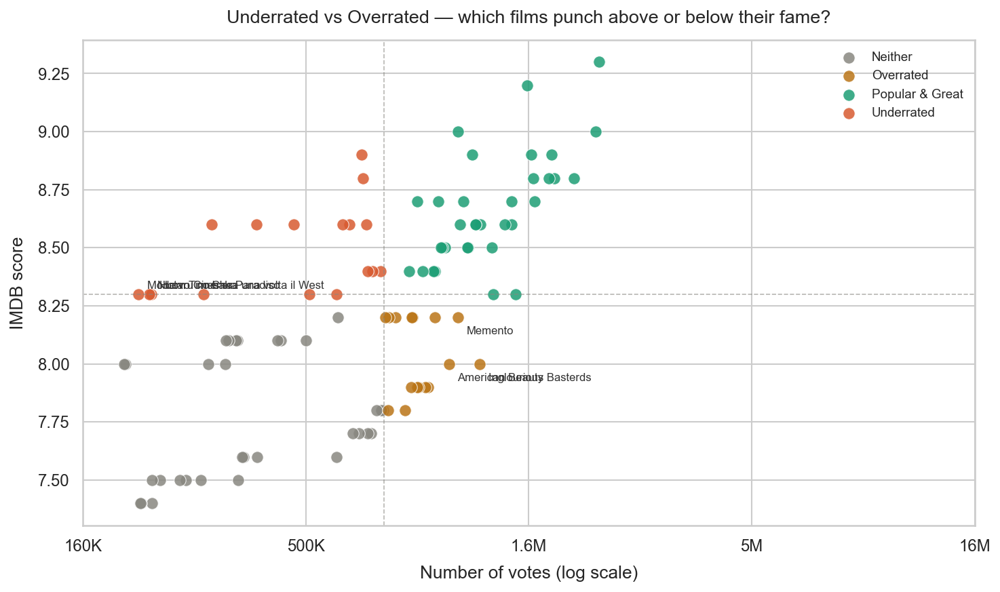

# IMDB-Project
I built this project to mainly practice my skills in data cleaning, visualization, feature engineering, and prediction on a real messy dataset. I worked on the messy IMDB dataset from Kaggle. I watch a lot of movies and I wanted to see if the numbers behind the ratings actually make sense.  

The goal wasn't to answer obvious questions. It was to dig into what actually explains an IMDB score and whether the rating system rewards genuine quality or just popularity. One part of the analysis focused on identifying “overrated” and “underrated” movies by comparing IMDB scores with popularity, since IMDB ratings are strongly influenced by public votes rather than strict objective standards.

## Questions answered
Which films are highly rated but unpopular?  
Which movies receive excessive popularity despite lower ratings? 
What factors most influence IMDB scores? 
Is there an optimal movie runtime? 
Which films did the model completely fail to predict? 

## Machine learning models:
Random Forest Regressor 
Gradient Boosting Regressor 
Evaluates model performance using: 
R² Score 
MAE 
RMSE 
Cross-validation 

## What i found
The question I was most interested in wasn't just "what predicts a high score" it was whether IMDB scores actually reflect quality or just exposure. Because if a film's rating is mostly driven by how many people voted on it, then the score is measuring popularity, not quality. And those are very different things.
So I split every film into four categories based on score and vote count: underrated, overrated, popular and great, and neither. The results are more interesting than I expected. 

Pre-1970 classics sit almost entirely in the underrated category, scores as high as anything modern, with a fraction of the votes. The model also struggled the most with these films, which makes sense. Their ratings can't be explained by runtime, genre, or box office numbers. Something else is carrying them and it doesn't fit in a spreadsheet.

## What i used
Python 
Pandas 
NumPy 
Scikit-learn 
Matplotlib 
Seaborn 
